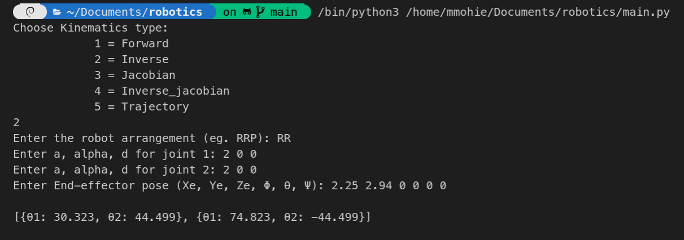
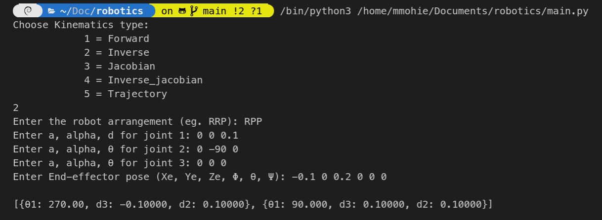
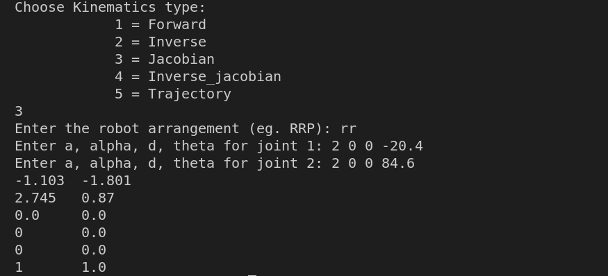
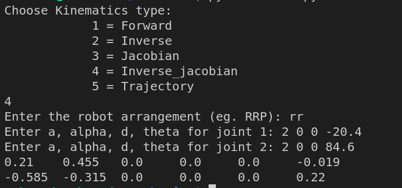

# Robotics project

## Forward kinematics function (FK)

**Description**: Forward kinematics is the use of kinematic equations to determine the position and orientation of the end effector.  
**Input**: Joint Variables, its DH parameter table.  
**Output**: Homogenous matrix include position and orientation of the end effector and Xe, Ye, Ze, Φ, θ, Ψ values.  
**Examples**:

1. **Input**:  
   No of Joints:<br> n<br>
   Joints Variables:<br> [a, alpha, d, theta]
    
   DH parameter table:  
    [ 2 0 0 30.323 ]  
    [ 2 0 0 44.499]  
   
   **Output**:<br>
   T = <br>
   [ 0.262 -0.965  0.     2.25 ]<br>
   [ 0.965  0.262  0.     2.94 ]<br>
   [ 0.     0.     1.     0.   ]<br>
   [ 0.     0.     0.     1.   ]<br>
   
   Xe Ye Ze : [2.25, 2.94, 0.0]<br>
   Θ, Φ, Ψ :  [0.0, 74.81021283021661, 0.0]


## Inverse kinematics function (IK)

**Description**: Inverse kinematics is the use of kinematic equations to determine the motion of a serial manipulator to reach a desired position.  
**Input**: Robot arrangement, its DH parameter table, and the end-effector pose.  
**Output**: Joint variables.  
**Examples**:

1. **Input**:  
   Robot arrangement:  
   RR  
   DH parameter table:  
    [ 2 0 0 ]  
    [ 2 0 0 ]  
   End-effector pose:  
   Xe = 2.25, Ye = 2.94, Ze=0, Φ=0, θ=0, Ψ=0

   **Output**:  
   [{θ1: 30.323, θ2: 44.499}, {θ1: 74.823, θ2: -44.499}]



2. **Input**:  
   Robot arrangement:
   RPP  
   DH parameter table:  
   [ 0 0 0.1 ]  
   [ 0 -90 0 ]  
   [ 0 0 0 ]  
   End-effector pose:  
   Xe = -0.1 Ye = 0 Ze = 0.2

   **Output**:  
   [{θ1: 270.00, d3: -0.10000, d2: 0.10000}, {θ1: 90.000, d3: 0.10000, d2: 0.10000}]

   

## Forward jacobian function (FJ)

**Description**: Jacobian is the use to discripe velocity of a serial manipulator to reach a desired position.  
**Input**: Robot arrangement, its DH parameter table.  
**Output**: Joint variables.  
**Example**:

1. **Input**:  
   Robot arrangement:  
   RR  
   DH parameter table:  
    [ 2 0 0 -20.4]  
    [ 2 0 0 84.6]

   **Output**:

   ```
   -1.103 -1.801
   2.745  0.87
   0.0    0.0
   0      -0.0
   0      -0.0
   1      1.0
   ```



## Inverse jacobian function (FJ)

**Description**: Inverse jacobian helps to descripe the motion of a serial manipulator through a certian path with a certain velocity.
**Input**: Robot arrangement, its DH parameter table.  
**Output**: Joint variables.  
**Example**:

1. **Input**:  
   Robot arrangement:  
   RR  
   DH parameter table:  
    [ 2 0 0 -20.4]  
    [ 2 0 0 84.6]

   **Output**:

   ```
   0.21    0.455   0.0     0.0     0.0     -0.019
   -0.585  -0.315  0.0     0.0     0.0     0.22
   ```



## Trajectory planning function (TP)
