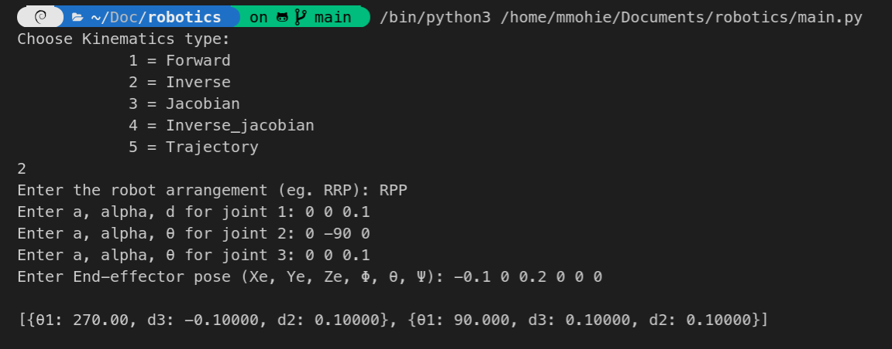

# Robotics project

## Forward kinematics function (FK)

**Description**: Forward kinematics function uses generalized kinematic equations to determine the position and orientation of the end effector.  
**Input**: Number of robot joints and its DH parameter table.  
**Output**: Homogeneous transformation matrix include position and orientation of the end effector and Xe, Ye, Ze, Φ, θ, Ψ values.  
**Examples**:

1. Two-link serial manipulator with RR arrangement

   

2. Three-link serial manipulator with RPP arrangement.

   

## Inverse kinematics function (IK)

**Description**: Inverse kinematics is the use of kinematic equations to determine the motion of a serial manipulator to reach a desired position.  
**Input**: Robot arrangement, its DH parameter table, and the end-effector pose.  
**Output**: Joint variables.  
**Examples**:

1. Two-link serial manipulator with RR arrangement

   

2. Three-link serial manipulator with RPP arrangement.

   

## Forward jacobian function (FJ)

**Description**: Forward jacobian is the use to describe velocity of a serial manipulator to reach a desired position.
**Input**: Robot arrangement, its DH parameter table.  
**Output**: Jacobian matrix.  
**Example**:

1. Two-link serial manipulator with RR arrangement

   

2. Three-link serial manipulator with RPP arrangement.

   

## Inverse jacobian function (FJ)

**Description**: Inverse jacobian helps to describe the motion of a serial manipulator through a certain path with a certain velocity.
**Input**: Robot arrangement, its DH parameter table.  
**Output**: Inverse Jacobian matrix.  
**Example**:

1. Two-link serial manipulator with RR arrangement

   

2. Three-link serial manipulator with RPP arrangement.

   

## Trajectory planning function (TP)

**Description**: A path is a sequence of points. Trajectory is a path with time history (velocities and accelerations). Trajectory planning is to relate the end effector trajectory with joints trajectories.  
**Input**: Robot arrangement, its DH parameter table, end-effector trajectory equations, time interval.  
**Output**: Joint variables function in terms of time.  
**Example**:

1. Two-link serial manipulator with RR arrangement

   
